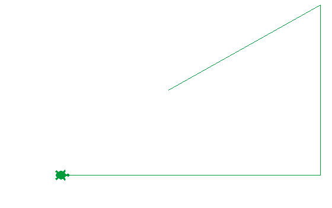
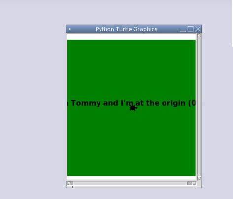

   
Turtle National Flag
====================

In this assignment, you will write a Python program that uses turtle graphics to display a flag. You may find slides 9 - 41 of the [Computer Programming B slide presentation](https://docs.google.com/presentation/d/1rICcmNbnGYsB-cV_6EatPyzcOS2sId80Jh2kayUzm4Q/edit?usp=sharing) helpful. You may also find this [Python Turtle tutorial](https://hourofpython.trinket.io/a-visual-introduction-to-python#/welcome/an-hour-of-code) or the [Python Turtle module documentation](https://docs.python.org/3.3/library/turtle.html?highlight=turtle) helpful in getting a sense of how Turtle graphics work. The CIA World Fact Book has [pictures of flags from around the world](https://www.cia.gov/the-world-factbook/references/flags-of-the-world/).

Suggested steps to starting this assignment:
----------------------------------------------
1. Start a new Python program. (If you are using repl.it see slides 10-15 of the [Computer Programming B slide presentation](https://docs.google.com/presentation/d/1rICcmNbnGYsB-cV_6EatPyzcOS2sId80Jh2kayUzm4Q/edit?usp=sharing) for step by step instructions. If you have installed Python on a Windows PC, see slides 16-20)
2. Give your program a meaningful name like *TurtleNationaLFlag*
5. Copy and paste the following starter code into your program:   
```python
import turtle

# create a new turtle object called tommy
tommy = turtle.Turtle() 
# make tommy's initial shape a turtle, look up what other shape turtles can be
tommy.shape("turtle") 
# initialize tommy's draw speed to be 10
tommy.speed(10)

#fill the background green using begin_fill() and end_fill()
tommy.color('green')
tommy.begin_fill()
tommy.goto(200,200)
tommy.goto(200,-200)
tommy.goto(-200,-200)
tommy.goto(-200,200)
tommy.goto(200,200)
tommy.end_fill()

# make tommy go back home
tommy.home()
# change tommy's color to black
tommy.color('black')
# display some text
tommy.write("I'm Tommy and I'm at the origin (0,0)", align="center", font=(None, 16, "bold"))
```

6. Click *Run* and you should see the following output:   
   
7. Now modify your running program to make a flag
8. When you are happy with your program submit it to google classroom. See slides 33-36 of the [Computer Programming B slide presentation](https://docs.google.com/presentation/d/1rICcmNbnGYsB-cV_6EatPyzcOS2sId80Jh2kayUzm4Q/edit?usp=sharing) for specific instructions. 

Additional Resources
------------
* You may find these [RGB Color Codes](https://flaviocopes.com/rgb-color-codes/) helpful 
* You may find a this [gallery of flags](https://en.wikipedia.org/wiki/Gallery_of_sovereign_state_flags) useful

Don't hesitate to ask for help if your aren't sure how something is suppose to work.

Samples of Student Work
-----------------------
[Damina](DamianFlag.gif)   
[Juan](JuanBrazil.gif)   
[Sally](SallyFlag.gif)   
[Dat](DatFlag.gif)   
[Tommy](TommyFlag.gif)   
[Benjamin](BenjaminFlag.gif)   
[Kami](KamiFlag.gif)   
[Gloria](GloriaFrance.gif)   
[Justin](JustinFlag.gif)   
[Marissa](MarissaFlag.gif)   
[Rachel](Rachel.gif)   
[Aaliyah](AaliyahFlag.JPG)   
[Pradipti](PradiptiFlag.JPG)   
[Roger](RogerFlag.JPG)   

     
         
*Thanks to Raymond Chan for this assignment*
