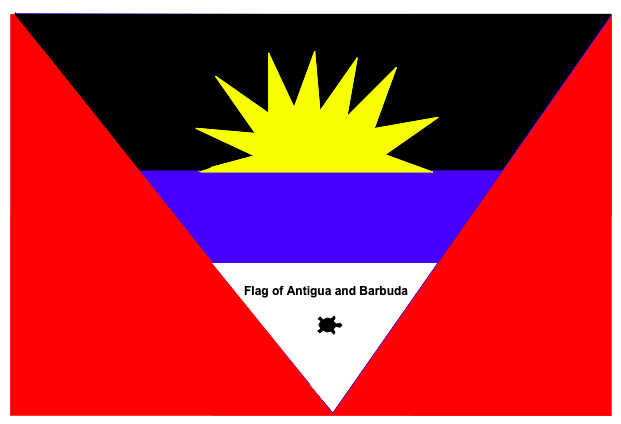
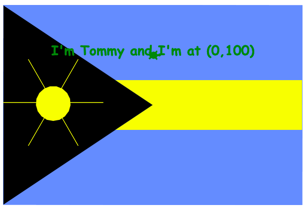
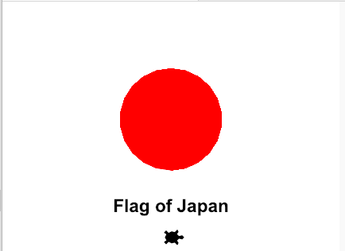

   
Turtle National Flag
====================

In this assignment, you will write a Python program that uses turtle graphics to display a design a national flag. You may find slides 4 - 12 of the [Computer Programming B slide presentation](https://docs.google.com/presentation/d/1rICcmNbnGYsB-cV_6EatPyzcOS2sId80Jh2kayUzm4Q/edit?usp=sharing) helpful.

Suggested steps to complete this assignment:
----------------------------------------------
1. Work through this [Python Turtle tutorial](https://hourofpython.trinket.io/a-visual-introduction-to-python#/welcome/an-hour-of-code) to get a sense of how Turtle graphics work
2. Sign up for an account at [repl.it](https://repl.it/) if you don't already have one
3. Create a new Python repl.it by clicking the blue plus button in the top right corner of your [Repls Dashboard](https://repl.it/repls)
4. Select *Python* and give your project a meaningful name like *TurtleNationaLFlag* and click *Create repl*
5. On line 1 of main.py, copy and paste the following starter code:   
```python
import turtle

# create a new turtle object called tommy
tommy = turtle.Turtle() 
# make tommy's inital shape a turtle, look up what else turtle's can be
tommy.shape("turtle") 
# initalize tommy's draw speed to be 10
tommy.speed(10)

#fill the background green using begin_fill() and end_fill()
tommy.color('green')
tommy.begin_fill()
tommy.goto(200,200)
tommy.goto(200,-200)
tommy.goto(-200,-200)
tommy.goto(-200,200)
tommy.goto(200,200)
tommy.end_fill()

# make tommy go back home
tommy.home()
# change tommy's color to black
tommy.color('black')
# display some text
tommy.write("I'm Tommy and I'm at the origin (0,0)", align="center", font=(None, 16, "bold"))
```

6. Click *Run* and you should see the following output:   
   

Extensions
------------
* You may find these [RGB Color Codes](http://www.tayloredmktg.com/rgb/) helpful 
* You may find a this [gallery of flags](https://en.wikipedia.org/wiki/Gallery_of_sovereign_state_flags) useful
* Here’s the [Python turtle module documentation:](https://docs.python.org/3.3/library/turtle.html?highlight=turtle)


Don't hesitate to ask for help if your aren't sure how something is suppose to work.

Samples of Student Work
-----------------------
     
     
*Thank you to Raymond Chan for this assignment*
